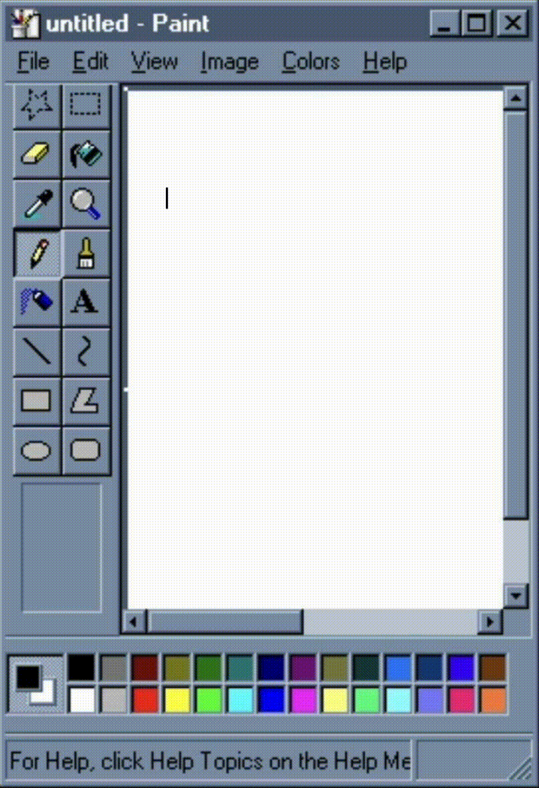

<table>
  <tr>
    <td valign="top" width="60%">
      <h1>Bren Funk</h1>
      

        <strong>Full-stack web/app developer</strong>
      

      Reach out to me:
        <a href="https://www.linkedin.com/in/brendyn-funk/">LinkedIn</a> |
        <a href="mailto:bfunk37@rrc.ca">Email</a>
      

   
      
Every public repository here reflects something that either pushed me beyond my comfort zone or sparked real joy as I strive to become a better developer.
      

      
Sharing my work publicly is a habit I’m trying to practice more intentionally. There are so many great ideas <i>(or almost ideas)</i> worth sharing, and I hope these projects can be useful to other developers   building on similar concepts. With that said, each repository represents a topic that’s had a real impact on me and my learning as I’ve grown to find my place in the world of software development.
      

       
      
Thanks for being here!

    </td>
    <td valign="top" width="50%">
        
      
    </td>

  </tr>
</table>

## Log: Jan 21, 2026

> Right now, I’m focused on the fundamentals of data science and machine learning, and on applying those ideas in my own projects. One book that’s helped in shaping how I think about this is <a href="https://www.goodreads.com/book/show/28186015-weapons-of-math-destruction">**“Weapons of Math Destruction”**.</a> As AI becomes more prominent, I feel a responsibility to understand how models inherit bias and what developers can do to reduce its impact.
>

### Related resources
- **[Solving a Million-Step LLM Task with Zero Errors (2025)](https://arxiv.org/abs/2511.09030)**
  - *Type:* Paper  
  - *Source:* arXiv:2511.09030
- **[Practical Deep Learning for Coders](https://course.fast.ai/Resources/book.html)**
  - *Type:* Course  
  - *Source:* Fast.ai (Jupyter NB, Google Colab)
- **[50 Days of Deep Learning](https://www.youtube.com/playlist?list=PLM8lYG2MzHmQn55ii0duXdO9QSoDF5myF)**
  - *Type:* Video Series  
  - *Source:* Misra Turp (YouTube)

