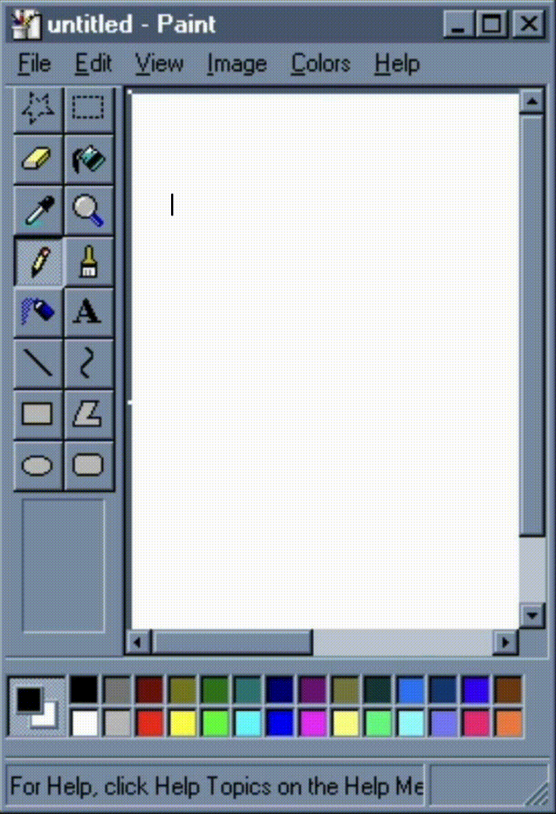

<table>
  <tr>
    <td valign="top" width="60%">
      <h1>Bren Henry</h1>
      

        <strong>Full-stack developer</strong>
      

      

      
Most of my repositories are private; however, I write technical docs over on my blog, which sometimes link to a public repo here that you can use and learn from!

      
With that said, if you find any of this interesting, please feel free to reach out and share your thoughts - better yet, correct me if I got something wrong!

      Places on the internet that you can find me:
        <a href="https://www.linkedin.com/in/brendyn-funk/">LinkedIn</a> |
        <a href="bh3nry.click">Blog</a>
    </td>
    <td valign="top" width="50%">
        
      
    </td>

  </tr>
</table>
